# Activities-and-intents
<b>Task 1</b>
 
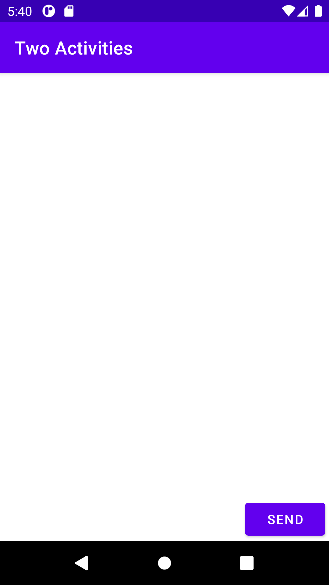
 
<b>Task 2</b>
 
First Activity
 

 
Second Activity
 
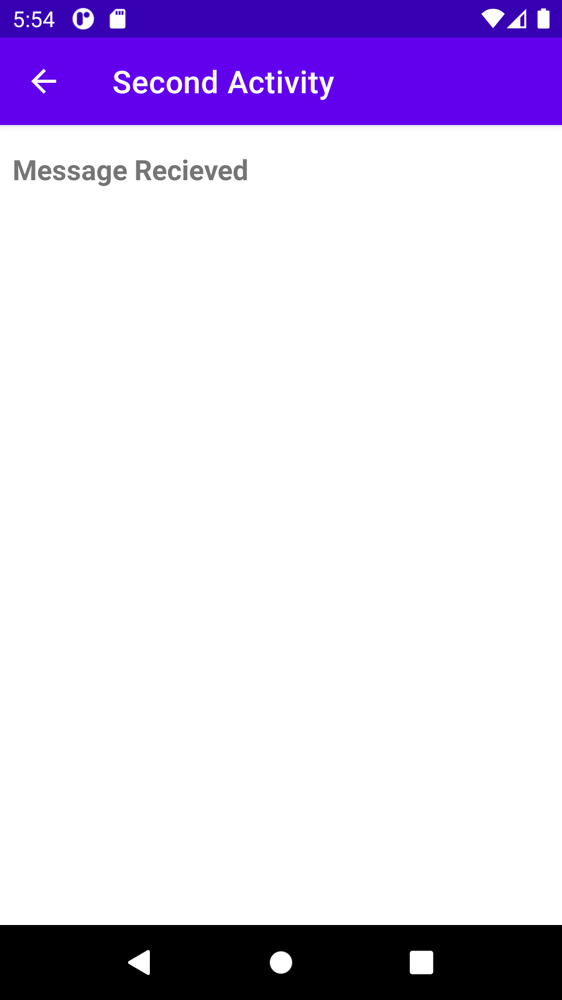
 
<b>Task 3</b>
 
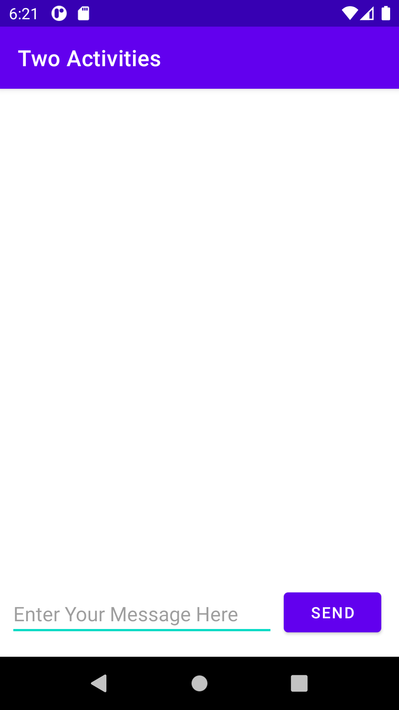
 
<b>Task 4</b>
 
Replying
 
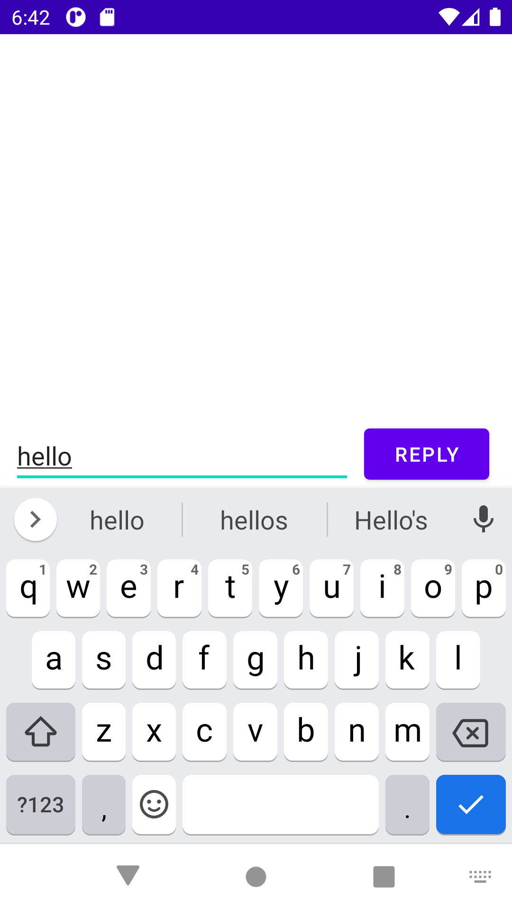
 
Reply Recieved
 
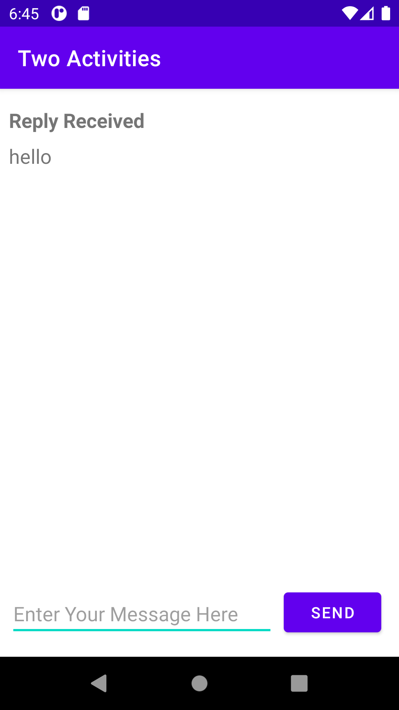
 
<b>Coding Challenge</b>
 
Front view
 
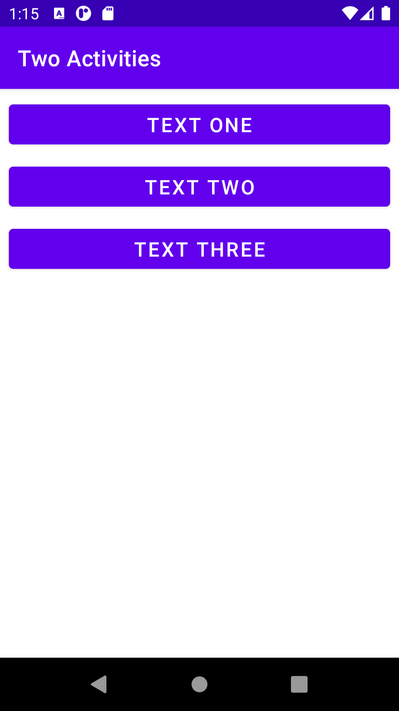
 
Text one
 
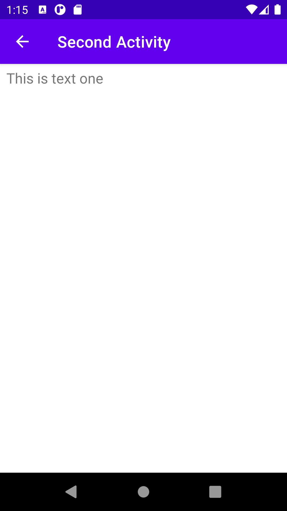
 
 
Text two
 
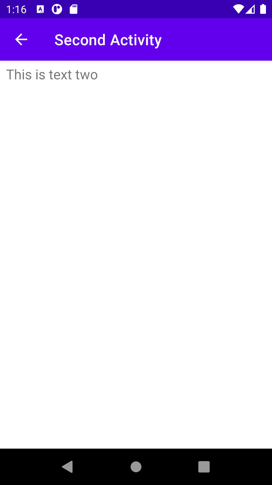
 
 
Text three
 
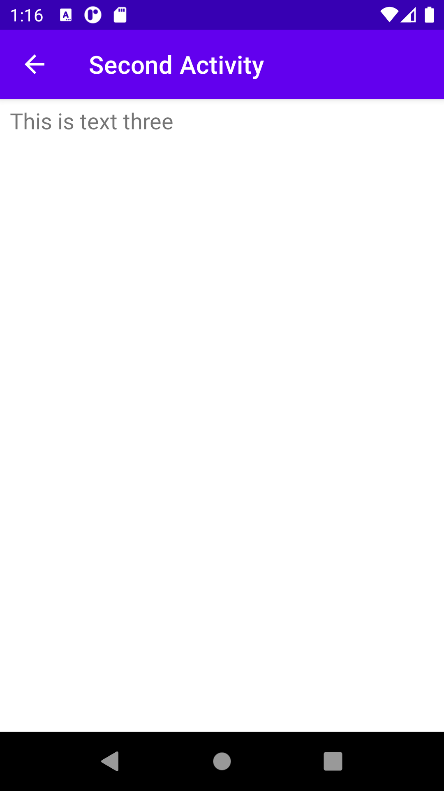
 
<b>Homework</b>
 
Front End
 
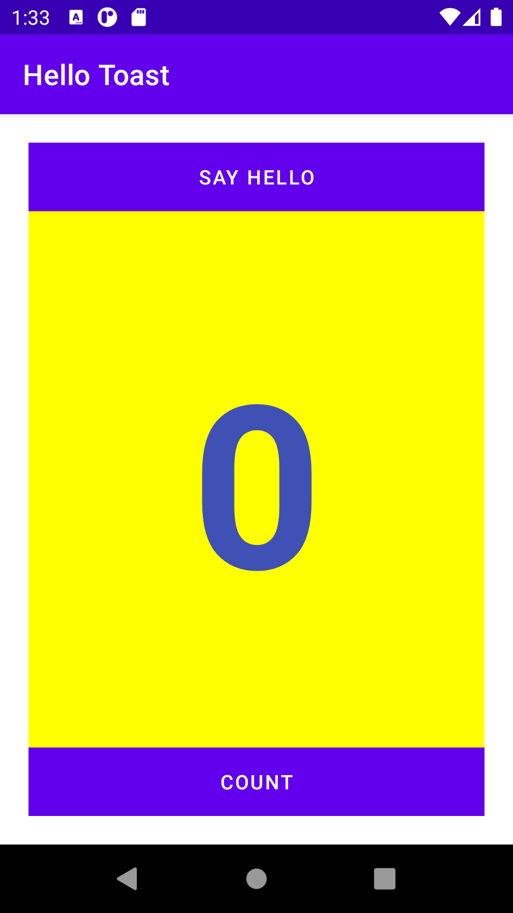
 
 
Count Pressed
 
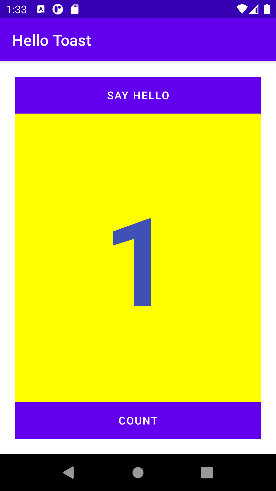
 
 
Say Hello Pressed
 
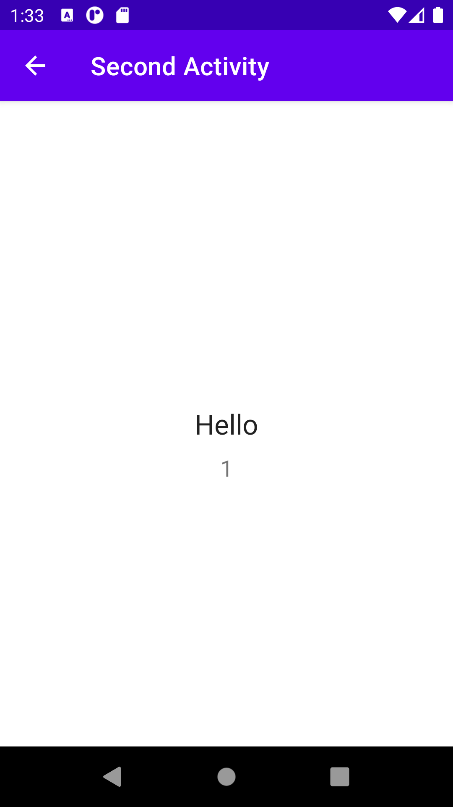
 
